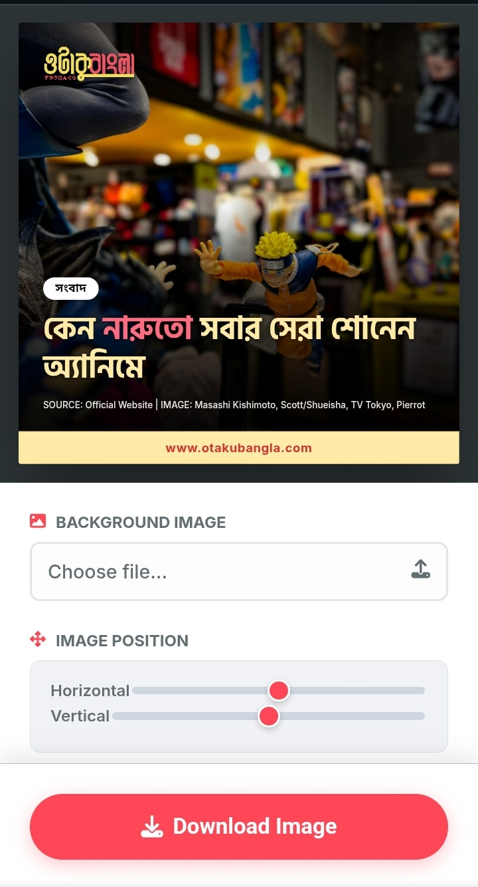

# Otaku Social Card Generator 🍥

A blazing fast, browser-based tool to generate high-quality social media sharing cards for [Otaku Bangla](https://www.otakubangla.com).

## ✨ Features

- **Anime Aesthetics:** Custom typography and color palette (Pastel Yellow & Anime Red) designed for the Otaku community.
- **Privacy First:** Runs 100% in the browser. No images or text are uploaded to any server.
- **Bengali Typography:** Native support for rendering complex Bengali scripts (*Juktakkhor*) perfectly.
- **Mobile Friendly:** Fully responsive UI with touch-friendly sliders and a floating action button.
- **Customizable:**
  - Drag sliders to position the background image (focus on the character/subject).
  - Highlight keywords in **Pink/Red** using simple HTML tags.
  - Custom source credits.

## 🚀 Usage

1. **Upload Image:** Select a high-quality background image (anime scene, manga panel, or cosplay).
2. **Set Position:** Use the X/Y sliders to frame the subject perfectly.
3. **Enter Details:**
   - **Category:** e.g., সংবাদ (News), রিভিউ (Review).
   - **Title:** Type the headline in Bengali. Use `text` to highlight specific words.
   - **Credit:** Add the source or artist credit.
4. **Download:** Click **Download Image** to save the PNG instantly.

## 🛠 Installation & Deployment

### Local Use
Simply download the `index.html` file and open it in any modern browser (Chrome, Edge, Safari).

### Deploy to Netlify (Recommended)
1. Push this folder to a GitHub repository.
2. Log in to [Netlify](https://www.netlify.com).
3. Click **"New site from Git"** and select your repository.
4. Hit **Deploy**. 
5. *(Optional)* Add this tool to your phone's home screen for an app-like experience.

## ⚙️ Configuration

- **Logo:** The tool looks for a `obmobilelogo.png` file in the root directory. Replace the default file with your own transparent PNG logo.
- **Defaults:** You can edit the `index.html` file to change the default placeholder text and images if needed.

## 💻 Tech Stack

- **HTML5 / CSS3** (Inter & Hind Siliguri fonts)
- **JavaScript (Vanilla)**
- **html2canvas** (DOM rendering engine)

---

This project is live on Netlify: [https://obpcard.netlify.app/]

*Built for the Otaku Bangla Team.*
